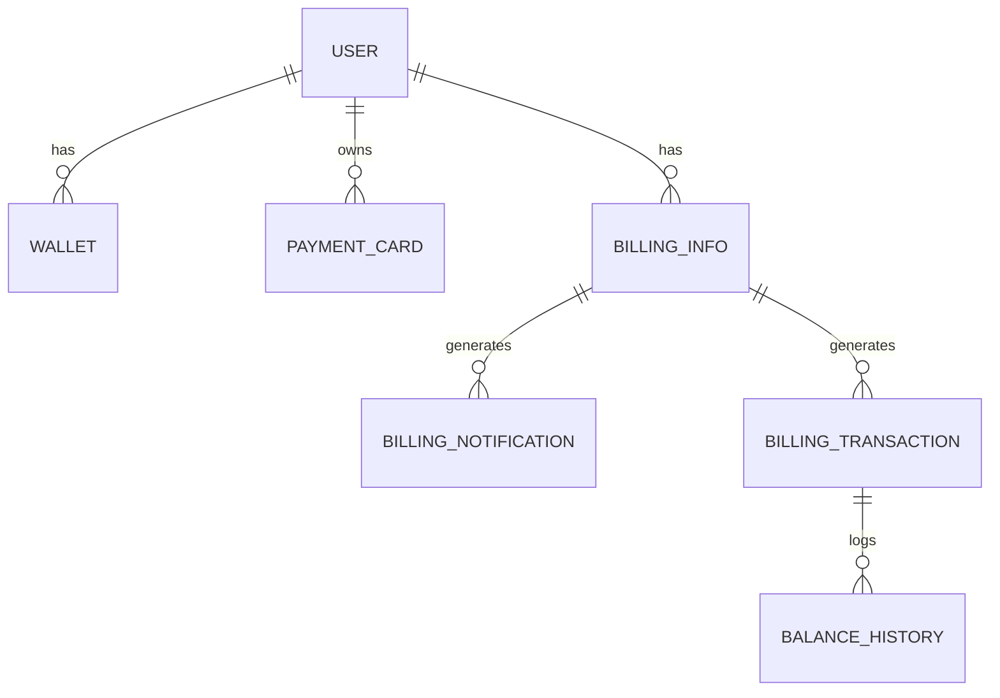

```mermaid
graph TD
  subgraph Features
    Auth[auth]
    Login[Login.tsx]
    Register[Register.tsx]
    UserDashboard[userDashboard]
    Dashboard[Dashboard.tsx]
    Profile[Profile.tsx]
    Wallet[wallet]
    WalletComp[Wallet.tsx]
    Payment[payment]
    StripePayment[StripePayment.tsx]
    Home[home]
    HomePage[Home.tsx]
    FeatureCoin[FeatureCoin.tsx]
    InfoCars[InfoCars.tsx]
    Stats[Stats.tsx]
    Testimonials[Testimonials.tsx]
    Game[game]
    GameMain[Game.tsx]
    BettingPanel[BettingPanel.tsx]
    RaceTrack[RaceTrack.tsx]
    Leaderboard[Leaderboard.tsx]
    Exchange[exchange]
    ExchangePage[Exchange.tsx]
    TradingChart[TradingChart.tsx]
    PlaceOrder[PlaceOrder.tsx]
    TradeHistory[TradeHistory.tsx]
    OrderBook[OrderBook.tsx]
    MarketStats[MarketStats.tsx]
    Utils[utils]
    SolanaUtil[solana.ts]
    Auth --> Login
    Auth --> Register
    UserDashboard --> Dashboard
    UserDashboard --> Profile
    Wallet --> WalletComp
    Payment --> StripePayment
    Home --> HomePage
    Home --> FeatureCoin
    Home --> InfoCars
    Home --> Stats
    Home --> Testimonials
    Game --> GameMain
    Game --> BettingPanel
    Game --> RaceTrack
    Game --> Leaderboard
    Exchange --> ExchangePage
    Exchange --> TradingChart
    Exchange --> PlaceOrder
    Exchange --> TradeHistory
    Exchange --> OrderBook
    Exchange --> MarketStats
    Utils --> SolanaUtil
  end

  subgraph UI
    Billing[Billing.tsx]
    Navbar[Navbar/index.tsx]
    SalesOverview[SalesOverview.tsx]
  end

  subgraph Context
    ThemeContext[ThemeContext.tsx]
  end

  subgraph Routing
    Routes[index.tsx]
    ProtectedRoute[ProtectedRoute.tsx]
  end

  subgraph Assets
    SVGs[svg/]
    Images[logo.png, guci.png, car-white.png, ...]
  end

  %% Main relationships
  Login --> Routes
  Register --> Routes
  Dashboard --> Routes
  Profile --> Routes
  HomePage --> Routes
  ExchangePage --> Routes
  GameMain --> Routes
  Navbar --> Routes
  Billing --> Dashboard
  SalesOverview --> Dashboard
  WalletComp --> Dashboard
  StripePayment --> Dashboard
  ThemeContext --> Routes
  ThemeContext --> Navbar
  SolanaUtil --> WalletComp
  SVGs --> Navbar
  Images --> HomePage
```

```mermaid
graph TD
  subgraph Server
    Index[index.js]
    Middleware[middleware/auth.js]
    Config[config/]
    DB[db/]
    Index --> Middleware
    Index --> Config
    Index --> DB
  end

  subgraph Models
    User[User.js]
    Wallet[Wallet.js]
    BillingInfo[BillingInfo.js]
    BillingNotification[BillingNotification.js]
    BillingTransaction[BillingTransaction.js]
    BalanceHistory[BalanceHistory.js]
    Invoice[Invoice.js]
    PaymentCard[PaymentCard.js]
    User --> Wallet
    User --> BillingInfo
    User --> PaymentCard
    BillingInfo --> BillingNotification
    BillingInfo --> BillingTransaction
    BillingTransaction --> BalanceHistory
  end

  subgraph Controllers
    WalletController[walletController.js]
    BillingController[billingController.js]
    ExchangeController[exchangeController.js]
    PaymentController[paymentController.js]
    TransactionsController[transactionsController.js]
    MarketplaceController[marketplaceController.js]
    DashboardController[dashboardController.js]
    WalletController --> Wallet
    BillingController --> BillingInfo
    BillingController --> BillingTransaction
    BillingController --> BillingNotification
    BillingController --> Invoice
    BillingController --> PaymentCard
    ExchangeController --> User
    PaymentController --> PaymentCard
    TransactionsController --> BillingTransaction
    MarketplaceController --> User
    DashboardController --> User
  end

  subgraph Routes
    AuthRoute[auth.js]
    WalletRoute[wallet.js]
    BillingRoute[billingRoutes.js]
    TransactionsRoute[transactions.js]
    PaymentRoute[payment.js]
    ExchangeRoute[exchange.js]
    DashboardRoute[dashboardRoutes.js]
    AuthRoute --> User
    WalletRoute --> WalletController
    BillingRoute --> BillingController
    TransactionsRoute --> TransactionsController
    PaymentRoute --> PaymentController
    ExchangeRoute --> ExchangeController
    DashboardRoute --> DashboardController
  end

  subgraph Migrations
    UserTables[user_tables.sql]
    PaymentTables[payment_tables.sql]
    BillingTables[billing_tables.sql]
    BillingImprovements[billing_improvements.sql]
    ExchangeTables[exchange_tables.sql]
    LeaderboardToken[leaderboard_and_token_price.sql]
    UserCars[user_cars_and_cars.sql]
    TempMigration[temp_migration.sql]
    UserTables --> User
    PaymentTables --> PaymentCard
    BillingTables --> BillingInfo
    BillingImprovements --> BillingInfo
    ExchangeTables --> ExchangeController
    LeaderboardToken --> DashboardController
    UserCars --> User
  end

  subgraph Solana
    SolanaScripts[solana-scripts/]
    TokenSetup[token-setup/]
    TokenMetadata[token-metadata/]
    SolanaScripts --> TokenSetup
    SolanaScripts --> TokenMetadata
    TokenSetup --> BillingController
    TokenMetadata --> BillingController
  end

  %% Main relationships
  Index --> AuthRoute
  Index --> WalletRoute
  Index --> BillingRoute
  Index --> TransactionsRoute
  Index --> PaymentRoute
  Index --> ExchangeRoute
  Index --> DashboardRoute
  AuthRoute --> User
  WalletRoute --> WalletController
  BillingRoute --> BillingController
  TransactionsRoute --> TransactionsController
  PaymentRoute --> PaymentController
  ExchangeRoute --> ExchangeController
  DashboardRoute --> DashboardController
```

# Racing F1 - Dossier Técnico

## Funcionalidad

Racing F1 es una plataforma web que permite a los usuarios:
- Registrarse e iniciar sesión.
- Gestionar su perfil y wallet.
- Apostar en carreras virtuales de coches.
- Visualizar estadísticas, rankings y resultados.
- Realizar pagos y recargas mediante Stripe y Solana.
- Intercambiar tokens en un exchange integrado.
- Visualizar facturación, historial y notificaciones.

---

## Diagramas UML y ER

### Arquitectura Frontend (Mermaid)

---

### Arquitectura Backend (Mermaid)

---

### Modelo ER (Base de datos)

---

## Explicación de arquitectura

### Frontend
- **React + Vite + Tailwind**: SPA moderna, modular y rápida.
- **Features**: Cada módulo (auth, dashboard, wallet, etc.) está aislado y es reutilizable.
- **UI**: Componentes visuales reutilizables y tematizados.
- **Context**: Gestión global de tema (oscuro/claro).
- **Routing**: Navegación protegida y pública.
- **Integración**: Consume APIs REST del backend y servicios de blockchain.

### Backend
- **Node.js + Express**: API RESTful robusta y escalable.
- **Modelos**: Definidos en JS, reflejan la estructura de la base de datos.
- **Controladores**: Lógica de negocio separada por dominio.
- **Rutas**: Endpoints RESTful claros y organizados.
- **Middlewares**: Seguridad y validación.
- **Solana**: Scripts para operaciones blockchain.
- **Migraciones**: Scripts SQL versionados para mantener la base de datos.

---

## Detalles de código

- **Frontend**: Uso de hooks, contextos, componentes funcionales, integración con Stripe y Solana.
- **Backend**: Uso de controladores, middlewares, modelos, integración con Solana, migraciones SQL.

---

## Dependencias principales

### Frontend
- `react`, `react-dom`, `react-router-dom`
- `tailwindcss`, `postcss`
- `@stripe/stripe-js`
- `@solana/web3.js`

### Backend
- `express`, `cors`, `jsonwebtoken`
- `sequelize` o `mongoose` (según ORM)
- `@solana/web3.js`
- `dotenv`
- `stripe`

---

## Endpoints del backend y objetos utilizados

| Método | Endpoint                | Descripción                        | Controlador           | Modelo/s Relacionados      |
|--------|-------------------------|------------------------------------|-----------------------|----------------------------|
| POST   | /api/auth/register      | Registro de usuario                | authController        | User                       |
| POST   | /api/auth/login         | Login de usuario                   | authController        | User                       |
| GET    | /api/wallet/:id         | Obtener wallet de usuario          | walletController      | Wallet                     |
| POST   | /api/wallet/transfer    | Transferir fondos                  | walletController      | Wallet, User               |
| GET    | /api/billing/info       | Info de facturación                | billingController     | BillingInfo, User          |
| POST   | /api/billing/pay        | Realizar pago                      | billingController     | BillingTransaction, User   |
| GET    | /api/transactions       | Historial de transacciones         | transactionsController| BillingTransaction         |
| POST   | /api/payment/stripe     | Pago con Stripe                    | paymentController     | PaymentCard, User          |
| GET    | /api/exchange/rates     | Obtener tasas de cambio            | exchangeController    | -                          |
| POST   | /api/exchange/trade     | Realizar trade                     | exchangeController    | User, Wallet               |
| GET    | /api/dashboard/summary  | Resumen para dashboard             | dashboardController   | User, Wallet, BillingInfo  |

---

