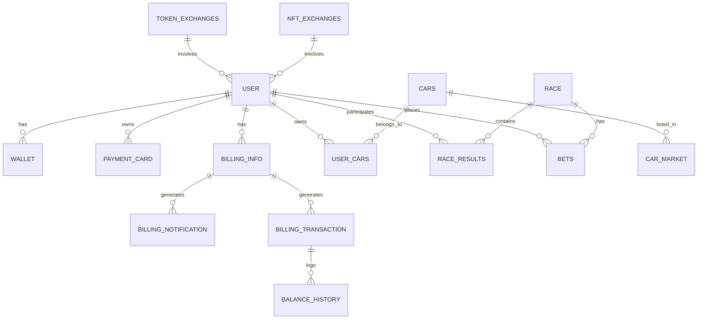

# Racing F1 - Technical Documentation

## Overview

Racing F1 is a cutting-edge blockchain gaming platform that combines the thrill of Formula 1 racing with blockchain technology, specifically using Solana for token transactions. The platform offers a unique gaming experience where players can:

- Race with virtual cars represented as NFTs
- Bet on races using the platform's native RCF token
- Trade cars in a decentralized marketplace
- Earn rewards through racing achievements
- Manage their crypto wallet seamlessly

## Core Features

### 1. Racing System
- Real-time 3D racing using Three.js and React Three Fiber
- Dynamic race tracks with physics simulation
- Multiple race modes (Time Trial, PvP, Tournament)
- Performance-based rewards system
- Real-time leaderboard updates

### 2. Car System
#### Available Categories:
- Formula Cars (High-performance racing vehicles)
- Sports Cars (Balanced performance and handling)
- Super Cars (Elite vehicles with top specifications)
- Muscle Cars (Power-focused classics)

#### Car Specifications:
- Power (HP)
- Acceleration (0-60 mph)
- Top Speed (mph)
- Weight (lbs)
- Unique 3D model with customizable views
- Performance ratings affecting race outcomes

### 3. Blockchain Integration
#### Solana Integration
- Native RCF token (SPL Token)
  - Address: `4MCKxwSEF3M6y9WsLiJtkoKaMtWh7eRhuV1gRUVZMg6w`
  - Used for betting, trading, and rewards
- NFT System for Cars
  - Each car is represented as a unique digital asset
  - Ownership tracked on Solana testnet
  - Transferable between users

#### Token Exchange System
- Direct token transfers between users
- NFT trading capabilities
- Marketplace for buying/selling cars
- Transaction history tracking
- Wallet balance management

### 4. User Features
- Profile management with gaming statistics
- Personal garage for car collection
- Racing history and achievements
- Wallet integration with Solana
- Betting system for races
- Social features and leaderboards

## Technical Architecture

### Frontend Architecture (Mermaid)

```mermaid
graph TD
  subgraph Features
    Auth[auth]
    Login[Login.tsx]
    Register[Register.tsx]
    UserDashboard[userDashboard]
    Dashboard[Dashboard.tsx]
    Profile[Profile.tsx]
    Wallet[wallet]
    WalletComp[Wallet.tsx]
    Payment[payment]
    StripePayment[StripePayment.tsx]
    Home[home]
    HomePage[Home.tsx]
    FeatureCoin[FeatureCoin.tsx]
    InfoCars[InfoCars.tsx]
    Stats[Stats.tsx]
    Testimonials[Testimonials.tsx]
    Game[game]
    GameMain[Game.tsx]
    BettingPanel[BettingPanel.tsx]
    RaceTrack[RaceTrack.tsx]
    Leaderboard[Leaderboard.tsx]
    Exchange[exchange]
    ExchangePage[Exchange.tsx]
    TradingChart[TradingChart.tsx]
    PlaceOrder[PlaceOrder.tsx]
    TradeHistory[TradeHistory.tsx]
    OrderBook[OrderBook.tsx]
    MarketStats[MarketStats.tsx]
    Utils[utils]
    SolanaUtil[solana.ts]
    Auth --> Login
    Auth --> Register
    UserDashboard --> Dashboard
    UserDashboard --> Profile
    Wallet --> WalletComp
    Payment --> StripePayment
    Home --> HomePage
    Home --> FeatureCoin
    Home --> InfoCars
    Home --> Stats
    Home --> Testimonials
    Game --> GameMain
    Game --> BettingPanel
    Game --> RaceTrack
    Game --> Leaderboard
    Exchange --> ExchangePage
    Exchange --> TradingChart
    Exchange --> PlaceOrder
    Exchange --> TradeHistory
    Exchange --> OrderBook
    Exchange --> MarketStats
    Utils --> SolanaUtil
  end

  subgraph UI
    Billing[Billing.tsx]
    Navbar[Navbar/index.tsx]
    SalesOverview[SalesOverview.tsx]
  end

  subgraph Context
    ThemeContext[ThemeContext.tsx]
  end

  subgraph Routing
    Routes[index.tsx]
    ProtectedRoute[ProtectedRoute.tsx]
  end

  subgraph Assets
    SVGs[svg/]
    Images[logo.png, guci.png, car-white.png, ...]
  end

  %% Main relationships
  Login --> Routes
  Register --> Routes
  Dashboard --> Routes
  Profile --> Routes
  HomePage --> Routes
  ExchangePage --> Routes
  GameMain --> Routes
  Navbar --> Routes
  Billing --> Dashboard
  SalesOverview --> Dashboard
  WalletComp --> Dashboard
  StripePayment --> Dashboard
  ThemeContext --> Routes
  ThemeContext --> Navbar
  SolanaUtil --> WalletComp
  SVGs --> Navbar
  Images --> HomePage
```



### Backend Architecture (Mermaid)

```mermaid
graph TD
  subgraph Server
    Index[index.js]
    Middleware[middleware/auth.js]
    Config[config/]
    DB[db/]
    Index --> Middleware
    Index --> Config
    Index --> DB
  end

  subgraph Models
    User[User.js]
    Wallet[Wallet.js]
    BillingInfo[BillingInfo.js]
    BillingNotification[BillingNotification.js]
    BillingTransaction[BillingTransaction.js]
    BalanceHistory[BalanceHistory.js]
    Invoice[Invoice.js]
    PaymentCard[PaymentCard.js]
    User --> Wallet
    User --> BillingInfo
    User --> PaymentCard
    BillingInfo --> BillingNotification
    BillingInfo --> BillingTransaction
    BillingTransaction --> BalanceHistory
  end

  subgraph Controllers
    WalletController[walletController.js]
    BillingController[billingController.js]
    ExchangeController[exchangeController.js]
    PaymentController[paymentController.js]
    TransactionsController[transactionsController.js]
    MarketplaceController[marketplaceController.js]
    DashboardController[dashboardController.js]
    WalletController --> Wallet
    BillingController --> BillingInfo
    BillingController --> BillingTransaction
    BillingController --> BillingNotification
    BillingController --> Invoice
    BillingController --> PaymentCard
    ExchangeController --> User
    PaymentController --> PaymentCard
    TransactionsController --> BillingTransaction
    MarketplaceController --> User
    DashboardController --> User
  end

  subgraph Routes
    AuthRoute[auth.js]
    WalletRoute[wallet.js]
    BillingRoute[billingRoutes.js]
    TransactionsRoute[transactions.js]
    PaymentRoute[payment.js]
    ExchangeRoute[exchange.js]
    DashboardRoute[dashboardRoutes.js]
    AuthRoute --> User
    WalletRoute --> WalletController
    BillingRoute --> BillingController
    TransactionsRoute --> TransactionsController
    PaymentRoute --> PaymentController
    ExchangeRoute --> ExchangeController
    DashboardRoute --> DashboardController
  end

  subgraph Migrations
    UserTables[user_tables.sql]
    PaymentTables[payment_tables.sql]
    BillingTables[billing_tables.sql]
    BillingImprovements[billing_improvements.sql]
    ExchangeTables[exchange_tables.sql]
    LeaderboardToken[leaderboard_and_token_price.sql]
    UserCars[user_cars_and_cars.sql]
    TempMigration[temp_migration.sql]
    UserTables --> User
    PaymentTables --> PaymentCard
    BillingTables --> BillingInfo
    BillingImprovements --> BillingInfo
    ExchangeTables --> ExchangeController
    LeaderboardToken --> DashboardController
    UserCars --> User
  end

  subgraph Solana
    SolanaScripts[solana-scripts/]
    TokenSetup[token-setup/]
    TokenMetadata[token-metadata/]
    SolanaScripts --> TokenSetup
    SolanaScripts --> TokenMetadata
    TokenSetup --> BillingController
    TokenMetadata --> BillingController
  end

  %% Main relationships
  Index --> AuthRoute
  Index --> WalletRoute
  Index --> BillingRoute
  Index --> TransactionsRoute
  Index --> PaymentRoute
  Index --> ExchangeRoute
  Index --> DashboardRoute
  AuthRoute --> User
  WalletRoute --> WalletController
  BillingRoute --> BillingController
  TransactionsRoute --> TransactionsController
  PaymentRoute --> PaymentController
  ExchangeRoute --> ExchangeController
  DashboardRoute --> DashboardController
```



### Database ER Model



## Technical Stack

### Frontend
- React + Vite + TypeScript
- Tailwind CSS for styling
- Three.js + React Three Fiber for 3D rendering
- @solana/web3.js for blockchain integration
- TanStack Query for state management
- WebSocket for real-time updates

### Backend
- Node.js + Express
- PostgreSQL database
- Solana Web3.js for blockchain operations
- JWT authentication
- WebSocket for real-time race updates
- Stripe integration for fiat payments

### Blockchain
- Solana Testnet
- SPL Token implementation
- NFT.Storage for metadata
- Metaplex for NFT standards

## API Endpoints

### Authentication
- `POST /auth/register` - User registration
- `POST /auth/login` - User login
- `GET /auth/user` - Get user data

### Game
- `GET /api/races/active` - Get active races
- `POST /api/races/bet` - Place a bet
- `GET /api/races/history` - Get race history

### Exchange
- `POST /exchange/token` - Transfer tokens
- `POST /exchange/nft` - Transfer NFTs
- `GET /transactions/history/:userId` - Transaction history

### Marketplace
- `GET /marketplace/listings` - Get available cars
- `POST /marketplace/buy/:listingId` - Buy a car
- `POST /marketplace/sell` - List a car for sale

## Development Setup

1. Clone the repository
```bash
git clone https://github.com/yourusername/Racing-F1.git
cd Racing-F1
```

2. Install dependencies
```bash
# Frontend
cd src/app
npm install

# Backend
cd server
npm install
```

3. Set up environment variables
```bash
# Frontend (.env)
VITE_API_URL=http://localhost:8080
VITE_WS_URL=ws://localhost:8080
VITE_SOLANA_NETWORK=testnet

# Backend (.env)
PORT=8080
JWT_SECRET=your_jwt_secret
SOLANA_PRIVATE_KEY=your_solana_private_key
MINT_ADDRESS_SOLANA=4MCKxwSEF3M6y9WsLiJtkoKaMtWh7eRhuV1gRUVZMg6w
```

4. Start the development servers
```bash
# Frontend
npm run dev

# Backend
npm run dev
```

## Security Considerations

- JWT authentication for API endpoints
- Solana wallet security best practices
- Rate limiting on sensitive endpoints
- Input validation and sanitization
- Secure WebSocket connections
- Environment variable protection

## Testing

- Unit tests for core components
- Integration tests for API endpoints
- E2E tests for critical user flows
- Smart contract testing on testnet
- Performance testing for race mechanics

## Deployment

- Frontend: Vercel/Netlify
- Backend: AWS/DigitalOcean
- Database: AWS RDS/DigitalOcean Managed Database
- WebSocket: AWS WebSocket API
- Monitoring: DataDog/New Relic

## Contributing

1. Fork the repository
2. Create a feature branch
3. Commit your changes
4. Push to the branch
5. Create a Pull Request

## License

This project is licensed under the MIT License - see the LICENSE file for details.

## Support

For support, please contact support@racingf1.com or join our Discord community.
